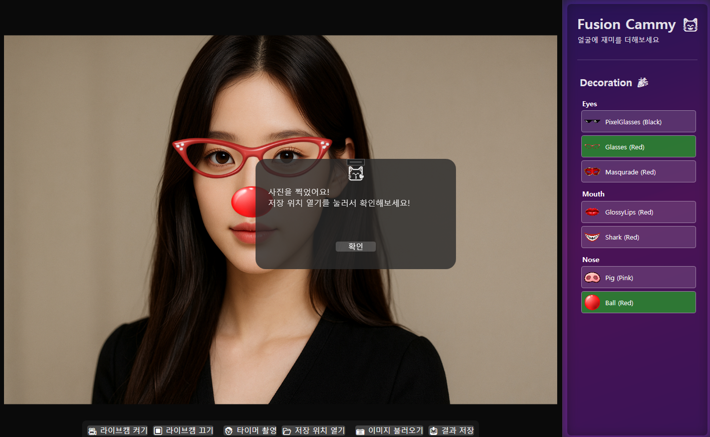
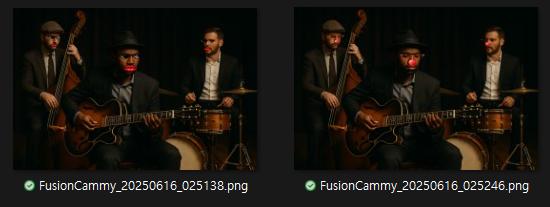

#  FusionCammy
* 사용자의 얼굴을 자동 인식하여 눈·코·입 등 주요 부위를 추적하고 다양한 장식을 합성하는 WPF 기반 Desktop App 프로젝트입니다.
* 포토부스 계열 서비스를 이해하고 구현하는 데 목적을 두었습니다. 

---

## 주요 기능

* **카메라 및 이미지 입력**
  * USB 또는 내장 웹캠을 통한 실시간 영상 입력
  * 이미지 파일 업로드를 통한 미리보기 기능

* **자동 얼굴 인식 및 장식 적용**
  * Dlib 기반 Landmark 탐지를 통한 얼굴 부위 인식
  * 장식 선택 후 부위별 위치 추적 및 정렬

* **결과 저장 기능**
  * 합성 결과를 PNG 형식으로 저장

---

## 설치 및 실행
* 운영체제: Windows 10 이상
* 실행 환경: .NET 8.0 Runtime 필요
* 하드웨어: USB 웹캠 또는 노트북 내장 카메라 필요
* 다운로드: [Release](https://github.com/StephenTheodore/FusionCammy/releases/tag/v1.0.1)에서 최신 실행 파일 다운로드 후 실행

---

## 사용 예시

### 1. 프로그램 초기 화면 구성요소

**기능 패널 (오른쪽)**
* `Decoration`: 적용할 장식을 선택 (Eyes, Mouth, Nose 카테고리 구분)

**하단 버튼 (왼쪽 → 오른쪽 순)**
* `라이브캠 켜기`: 카메라 촬영 시작, 정지하기 전까지 지속
* `라이브캠 끄기`: 카메라 정지
* `타이머 촬영`: 10초 내외 카운트다운 후 이미지 자동 저장
* `저장 위치 열기`: 이미지 저장 폴더 열기
* `이미지 불러오기`: 기존 이미지 파일 열기
* `결과 저장`: **이미지 불러오기**로 불러온 합성 미리보기 이미지 저장

### 2. 인식 전 예시 이미지

### 3. 타이머 촬영 기능

* `타이머 촬영` 버튼을 누르면 Live 기능이 활성화 되며, 첫 번째 사진의 상단처럼 준비할 시간이 주어짐
* 화면 가운데 완료 팝업이 나온 후 이미지 저장 경로에서 확인

### 4. 다양한 조합의 데코레이션 프리뷰

* `이미지 불러오기` 기능을 통해 컴퓨터에 저장된 이미지를 불러오고, 합성 테스트를 할 수 있음
* 불러오기 기능을 통해 테스트한 결과는 `결과 저장`을 눌러 저장

### 5. 저장된 이미지 예시

* 기본 경로: "사진/FusionCammy/이미지.png"

---

## 적용 기술
* **UI 프레임워크**: WPF (.NET 8) + CommunityToolkit.MVVM + Microsoft.Extensions.DependencyInjection 등
* **이미지 처리**: OpenCvSharp4(알파 블렌딩 및 회전 적용), DirectShowLib.Net(카메라 조회 및 해상도 매핑)
* **얼굴 인식**: DlibDotNet (shape_predictor_68_face_landmarks)
* **배포**: GitHub Actions

---

## Technical Issues Encountered
* **이미지 처리**
  * WPF 자체 GPU 가속을 활용하고 싶은데 어떤 방식으로 이미지 보관할지
  * Dlib.LoadImageData<BgrPixel>(imagePointer) 사용 시 OpenCvSharp.Mat.Data를 넣으면 AccessViolation발생, Marshal.Copy로 복사하여 해결
* **알파 블렌딩 및 Overlay 회전 계산**
  * Overlay 회전 시 픽셀 경계면에서 손실이 발생한 원인을 알파 블렌딩으로 오인
  * WarpAffine 후 ROI 벗어남, MinAreaRect 기준 불안정한 중심 좌표 계산 등
* **객체 설계 관련**
  * 객체 간 책임 분리
  * 규모를 어느정도로 가져가야 구현이 빠를까

---

## To-Do
* **성능 최적화**
  * UI 스레드에서 수행 중인 이미지 전처리 분리 및 비동기화
  * 얼굴 추적 주기 동적 조정 로직 도입
* **UI 및 화면 구성 고도화**
  * TimeLine 및 Gallery Page 도입
  * NavigationWindow 기반 페이지 전환 구조 적용
  * SplashWindow 및 ProgressIndicator 추가 구현
* **설정 구조 개선**
  * 각종 설정 항목 IOptions으로 분리
  * 애셋 및 사용자 설정 정보를 메타데이터로 저장, 관리
* **애셋 시스템 확장**
  * Expander UI로 카테고리별 장식 분류
  * 사용자 정의 애셋 추가 기능 제공
